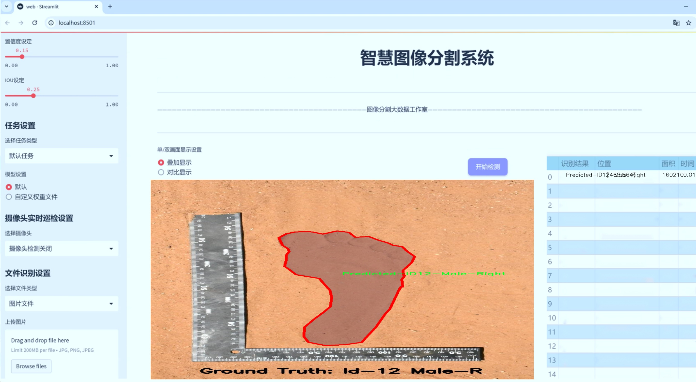
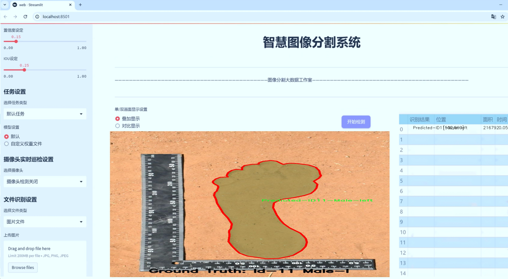
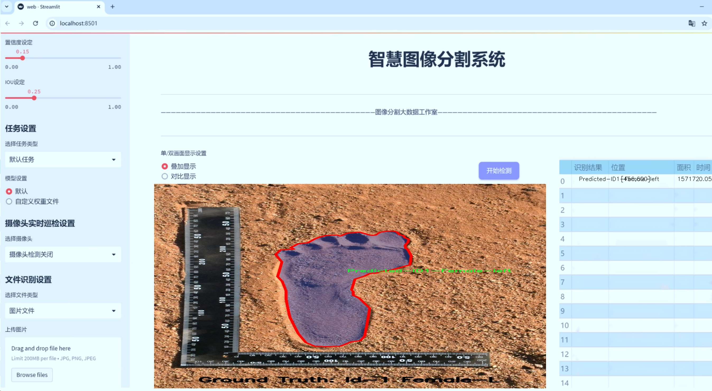
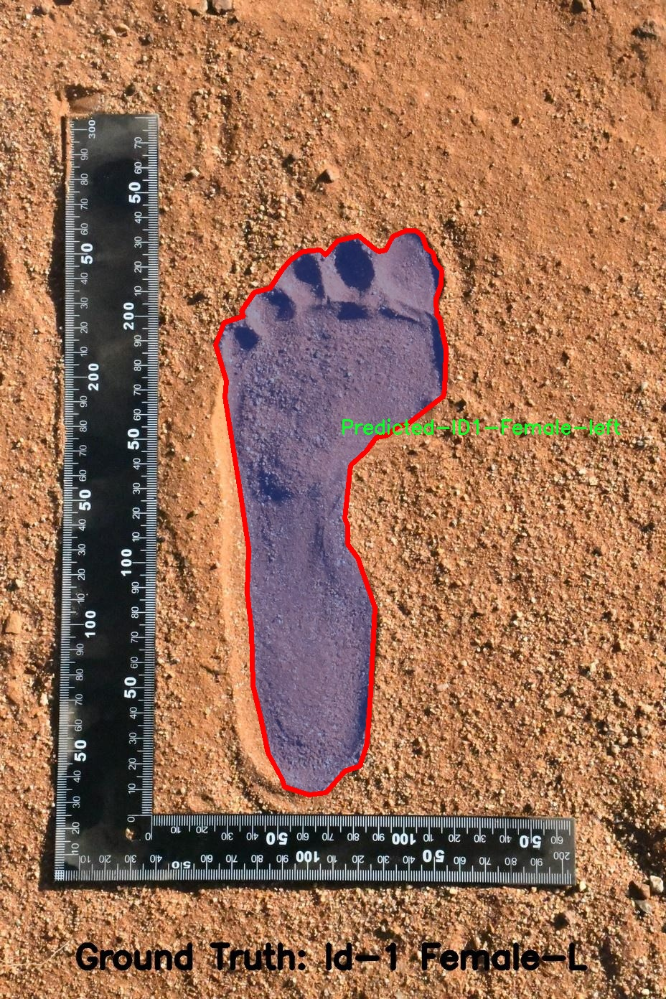
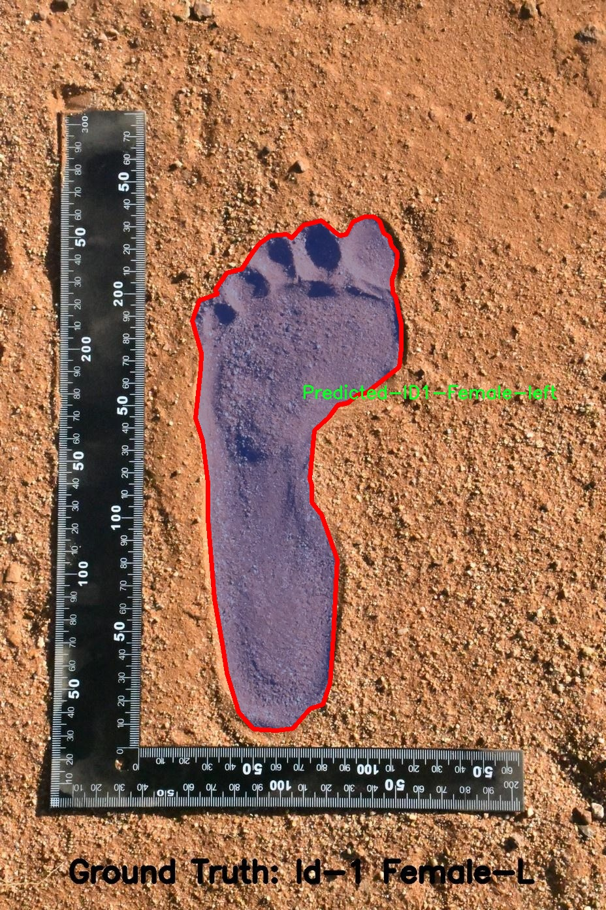
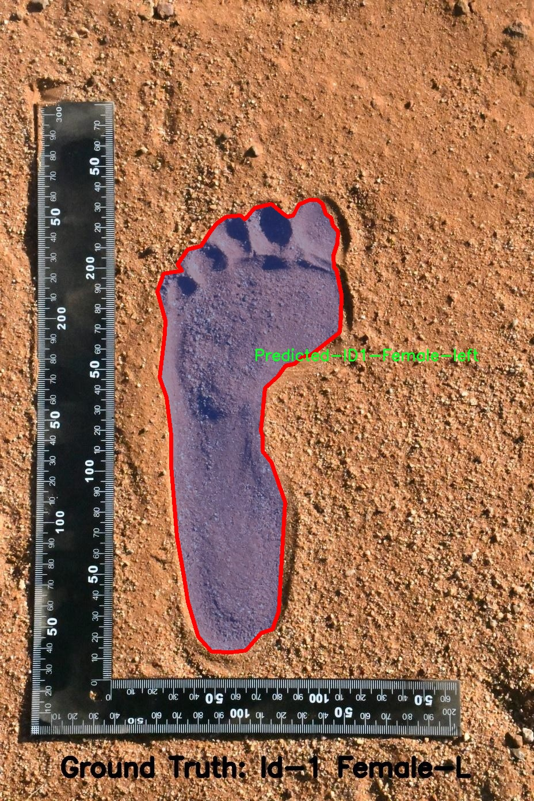
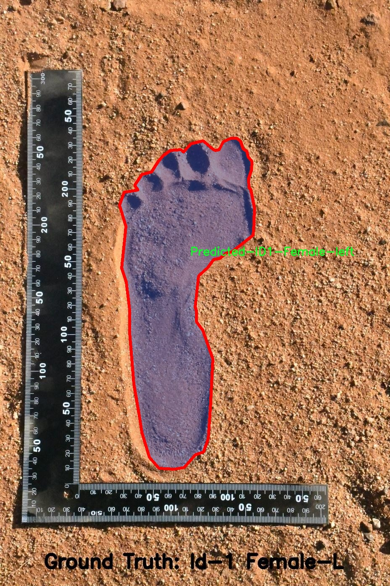
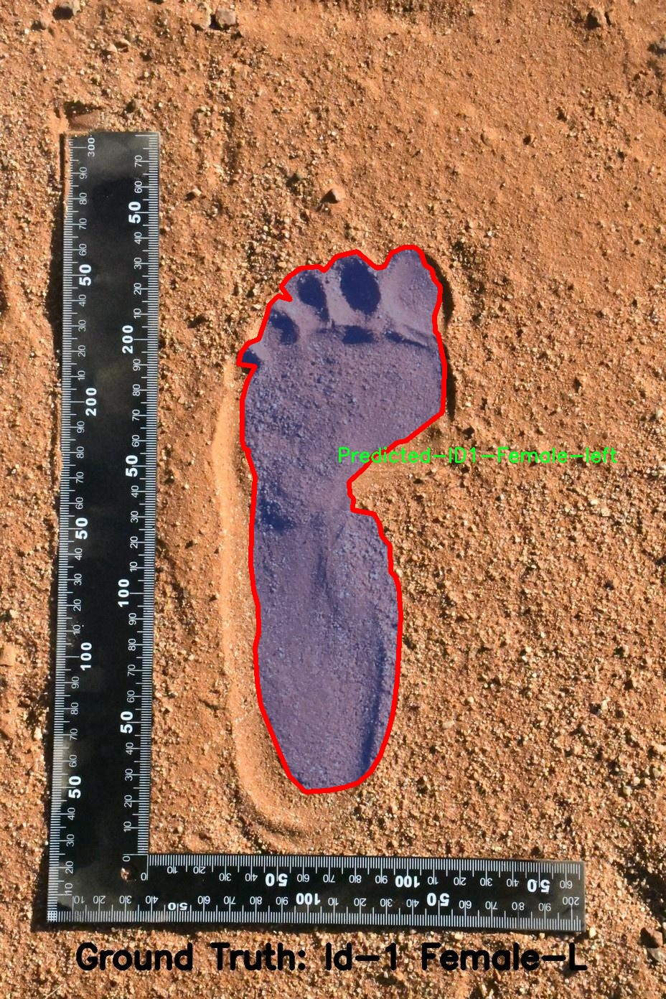

# 脚掌沙模尺寸图像分割系统： yolov8-seg-repvit

### 1.研究背景与意义

[参考博客](https://gitee.com/YOLOv8_YOLOv11_Segmentation_Studio/projects)

[博客来源](https://kdocs.cn/l/cszuIiCKVNis)

研究背景与意义

随着计算机视觉技术的迅猛发展，图像分割作为其核心任务之一，已经在多个领域得到了广泛应用。尤其是在医学影像分析、自动驾驶、智能监控等领域，精确的图像分割技术能够有效提高系统的智能化水平和应用效果。在此背景下，基于深度学习的目标检测和分割算法逐渐成为研究的热点。其中，YOLO（You Only Look Once）系列算法因其高效性和实时性而受到广泛关注。YOLOv8作为该系列的最新版本，进一步提升了目标检测和分割的精度与速度，展现出良好的应用前景。

本研究旨在基于改进的YOLOv8模型，构建一个针对脚掌沙模尺寸的图像分割系统。脚掌沙模的研究在生物力学、运动科学以及康复医学等领域具有重要意义。通过对脚掌沙模的精确测量与分析，能够为个性化鞋垫设计、运动员训练及康复治疗提供科学依据。然而，传统的手工测量方法不仅耗时耗力，而且容易受到人为因素的影响，导致测量结果的不准确。因此，利用计算机视觉技术进行自动化的图像分割，将极大地提高测量的效率和准确性。

本研究所使用的数据集包含2700幅图像，涵盖24个类别，涉及不同性别和脚掌类型的样本。这一丰富的数据集为模型的训练和验证提供了坚实的基础。通过对不同类别的脚掌沙模进行细致的分割，能够实现对脚掌形态的全面分析，从而为后续的研究提供更为精准的数据支持。此外，数据集中包含的多样性样本，能够有效提高模型的泛化能力，使其在实际应用中具备更强的适应性。

在技术层面，改进YOLOv8模型的引入，不仅提升了图像分割的精度，还优化了处理速度，使得系统能够在实时应用场景中发挥作用。通过对模型结构的改进与优化，结合特定的损失函数和数据增强策略，本研究将进一步提升脚掌沙模的分割效果。尤其是在处理复杂背景和不同光照条件下，改进后的模型能够更好地识别和分割目标，确保结果的可靠性。

综上所述，基于改进YOLOv8的脚掌沙模尺寸图像分割系统的研究，不仅填补了当前相关领域的技术空白，还为实际应用提供了新的解决方案。通过实现高效、准确的图像分割，能够推动脚掌研究的深入发展，进而为个性化医疗、运动科学等领域的进步贡献力量。这一研究的开展，将为未来的相关研究提供重要的理论基础和实践参考，具有重要的学术价值和应用前景。

### 2.图片演示







注意：本项目提供完整的训练源码数据集和训练教程,由于此博客编辑较早,暂不提供权重文件（best.pt）,需要按照6.训练教程进行训练后实现上图效果。

### 3.视频演示

[3.1 视频演示](https://www.bilibili.com/video/BV1knzmYGE2o/)

### 4.数据集信息

##### 4.1 数据集类别数＆类别名

nc: 24
names: ['Predicted-ID1-Female-Right', 'Predicted-ID1-Female-left', 'Predicted-ID11-Male-Right', 'Predicted-ID11-Male-left', 'Predicted-ID12-Male-Right', 'Predicted-ID12-Male-left', 'Predicted-ID13-Male-Right', 'Predicted-ID13-Male-left', 'Predicted-ID14-Male-Right', 'Predicted-ID14-Male-left', 'Predicted-ID15-Female-Right', 'Predicted-ID15-Female-left', 'Predicted-ID15-Male-Right', 'Predicted-ID15-Male-left', 'Predicted-ID16-Male-Right', 'Predicted-ID16-Male-left', 'Predicted-ID18-Female-Right', 'Predicted-ID18-Female-left', 'Predicted-ID2-Female-Right', 'Predicted-ID2-Female-left', 'Predicted-ID20-Female-Right', 'Predicted-ID20-Female-left', 'Predicted-ID4-Female-Right', 'Predicted-ID4-Female-left']


##### 4.2 数据集信息简介

数据集信息展示

在本研究中，我们使用了名为“Segmentation soft soil”的数据集，旨在训练和改进YOLOv8-seg模型，以实现对脚掌沙模尺寸的高效图像分割。该数据集包含24个类别，涵盖了不同性别和不同方向的脚掌图像，具体类别包括多种预测ID，分别对应于男性和女性的右脚和左脚。这样的多样性使得模型能够学习到不同脚掌的特征，从而提高分割的准确性和鲁棒性。

数据集中每个类别的命名方式都遵循了一定的规则，便于识别和分类。例如，类别名称中包含“Predicted-ID”前缀，后接数字标识符，表示不同的个体或样本，最后以性别和脚掌方向进行区分。这种结构化的命名方式不仅提高了数据集的可读性，也为后续的模型训练和评估提供了便利。

具体而言，数据集中包括的类别有：Predicted-ID1-Female-Right、Predicted-ID1-Female-left、Predicted-ID11-Male-Right、Predicted-ID11-Male-left、Predicted-ID12-Male-Right、Predicted-ID12-Male-left、Predicted-ID13-Male-Right、Predicted-ID13-Male-left、Predicted-ID14-Male-Right、Predicted-ID14-Male-left、Predicted-ID15-Female-Right、Predicted-ID15-Female-left、Predicted-ID15-Male-Right、Predicted-ID15-Male-left、Predicted-ID16-Male-Right、Predicted-ID16-Male-left、Predicted-ID18-Female-Right、Predicted-ID18-Female-left、Predicted-ID2-Female-Right、Predicted-ID2-Female-left、Predicted-ID20-Female-Right、Predicted-ID20-Female-left、Predicted-ID4-Female-Right、Predicted-ID4-Female-left。这些类别的设置使得模型在训练过程中能够充分捕捉到不同脚掌的形状、纹理和其他视觉特征。

在数据集的构建过程中，图像的采集和标注是至关重要的环节。每个类别的图像都经过精心挑选和标注，确保其在训练时能够提供准确的信息。这种高质量的数据输入是实现有效模型训练的基础，能够显著提升YOLOv8-seg在脚掌沙模尺寸图像分割任务中的表现。

此外，数据集的多样性也为模型的泛化能力提供了保障。通过包含不同性别、不同方向的脚掌图像，模型能够学习到更为广泛的特征，从而在面对未知数据时，依然能够保持较高的分割精度。这种泛化能力在实际应用中尤为重要，尤其是在需要处理多样化脚掌形态的场景中。

综上所述，“Segmentation soft soil”数据集不仅为YOLOv8-seg模型的训练提供了丰富的样本，也为脚掌沙模尺寸图像分割任务的研究奠定了坚实的基础。通过对该数据集的深入分析和利用，我们期望能够在图像分割领域取得更为显著的进展，推动相关技术的应用与发展。











### 5.项目依赖环境部署教程（零基础手把手教学）

[5.1 环境部署教程链接（零基础手把手教学）](https://www.bilibili.com/video/BV1jG4Ve4E9t/?vd_source=bc9aec86d164b67a7004b996143742dc)


[5.2 安装Python虚拟环境创建和依赖库安装视频教程链接（零基础手把手教学）](https://www.bilibili.com/video/BV1nA4VeYEze/?vd_source=bc9aec86d164b67a7004b996143742dc)

### 6.手把手YOLOV8-seg训练视频教程（零基础手把手教学）

[6.1 手把手YOLOV8-seg训练视频教程（零基础小白有手就能学会）](https://www.bilibili.com/video/BV1cA4VeYETe/?vd_source=bc9aec86d164b67a7004b996143742dc)


按照上面的训练视频教程链接加载项目提供的数据集，运行train.py即可开始训练



     Epoch   gpu_mem       box       obj       cls    labels  img_size
     1/200     0G   0.01576   0.01955  0.007536        22      1280: 100%|██████████| 849/849 [14:42<00:00,  1.04s/it]
               Class     Images     Labels          P          R     mAP@.5 mAP@.5:.95: 100%|██████████| 213/213 [01:14<00:00,  2.87it/s]
                 all       3395      17314      0.994      0.957      0.0957      0.0843

     Epoch   gpu_mem       box       obj       cls    labels  img_size
     2/200     0G   0.01578   0.01923  0.007006        22      1280: 100%|██████████| 849/849 [14:44<00:00,  1.04s/it]
               Class     Images     Labels          P          R     mAP@.5 mAP@.5:.95: 100%|██████████| 213/213 [01:12<00:00,  2.95it/s]
                 all       3395      17314      0.996      0.956      0.0957      0.0845

     Epoch   gpu_mem       box       obj       cls    labels  img_size
     3/200     0G   0.01561    0.0191  0.006895        27      1280: 100%|██████████| 849/849 [10:56<00:00,  1.29it/s]
               Class     Images     Labels          P          R     mAP@.5 mAP@.5:.95: 100%|███████   | 187/213 [00:52<00:00,  4.04it/s]
                 all       3395      17314      0.996      0.957      0.0957      0.0845


### 7.50+种全套YOLOV8-seg创新点加载调参实验视频教程（一键加载写好的改进模型的配置文件）

[7.1 50+种全套YOLOV8-seg创新点加载调参实验视频教程（一键加载写好的改进模型的配置文件）](https://www.bilibili.com/video/BV1Hw4VePEXv/?vd_source=bc9aec86d164b67a7004b996143742dc)

### YOLOV8-seg算法简介

原始YOLOv8-seg算法原理

YOLOv8-seg算法是Ultralytics公司在2023年推出的目标检测与图像分割领域的一个重要进展。作为YOLO系列的最新版本，YOLOv8不仅继承了前几代算法的优点，还在结构设计、功能扩展和性能优化方面进行了显著的改进。其核心目标是实现快速、准确且易于使用的目标检测和图像分割，适用于各种实际应用场景。

首先，YOLOv8的输入处理部分采用了640x640的默认图像尺寸，然而在实际应用中，输入图像的长宽比往往各不相同。为了解决这一问题，YOLOv8引入了自适应图片缩放技术。这一技术的核心思想是将图像的长边按比例缩小至指定尺寸后，对短边进行填充，从而最大限度地减少填充区域，降低信息冗余。这种方法不仅提高了目标检测的速度，也保证了模型在不同输入条件下的鲁棒性。此外，在模型训练阶段，YOLOv8采用了Mosaic图像增强技术，通过随机选择四张图像进行缩放和拼接，生成新的训练样本。这种增强方法使得模型能够在多样化的背景和位置中学习，从而提升了预测精度和模型的整体性能。

在网络结构方面，YOLOv8的主干网络（Backbone）进行了重要的改进。YOLOv8借鉴了YOLOv7中的ELAN模块设计思想，将YOLOv5中的C3模块替换为C2F模块。C2F模块通过并行多个梯度流分支，既保证了网络的轻量化，又能够获取更丰富的梯度信息，从而提高了模型的精度和响应速度。YOLOv8的Backbone部分由多个CBS模块、C2F模块和一个快速空间金字塔池化（SPPF）模块组成，这种结构设计有效地增强了特征提取的能力，使得模型能够更好地捕捉不同尺度的目标信息。

在Neck部分，YOLOv8同样进行了优化。与YOLOv5相比，YOLOv8去除了多余的卷积连接层，直接对来自Backbone不同阶段的特征图进行上采样处理。这种设计不仅简化了网络结构，还提升了特征融合的效率，使得模型在处理多尺度目标时表现得更加出色。通过有效的特征融合，YOLOv8能够更好地捕捉到目标的细节信息，提高了目标检测的准确性和鲁棒性。

YOLOv8的Head部分是其最大的创新之一。在这一部分，YOLOv8采用了Decoupled-Head结构，区别于YOLOv5的Coupled-Head结构。具体而言，YOLOv8将检测和分类的卷积操作解耦，分别通过两个1x1卷积模块进行处理。这种设计使得模型在进行类别预测和边界框回归时，能够更加专注于各自的任务，提升了预测的准确性。此外，YOLOv8在损失函数的设计上也进行了创新，取消了Obj分支，采用BCELoss和DFL+CIoULoss相结合的方式，使得模型在训练过程中能够更快地聚焦于标签附近的数值，提高了训练效率。

值得注意的是，YOLOv8抛弃了传统的Anchor-Based方法，转而采用Anchor-Free的目标检测策略。这一策略的核心在于将目标检测问题转化为关键点检测，避免了对锚框的预设和计算，简化了模型的复杂性，同时增强了模型的泛化能力。这种方法不仅提高了模型的灵活性，还使得YOLOv8在处理不同类型的目标时表现得更加优越。

综上所述，YOLOv8-seg算法通过一系列结构优化和创新设计，在目标检测和图像分割任务中展现出了卓越的性能。其自适应输入处理、轻量化的Backbone、有效的特征融合以及解耦的Head结构，使得YOLOv8在处理复杂场景时具备了更高的准确性和效率。随着YOLOv8的广泛应用，未来在目标检测和图像分割领域的研究和应用将迎来新的机遇和挑战。


### 9.系统功能展示（检测对象为举例，实际内容以本项目数据集为准）

图9.1.系统支持检测结果表格显示

  图9.2.系统支持置信度和IOU阈值手动调节

  图9.3.系统支持自定义加载权重文件best.pt(需要你通过步骤5中训练获得)

  图9.4.系统支持摄像头实时识别

  图9.5.系统支持图片识别

  图9.6.系统支持视频识别

  图9.7.系统支持识别结果文件自动保存

  图9.8.系统支持Excel导出检测结果数据


### 10.50+种全套YOLOV8-seg创新点原理讲解（非科班也可以轻松写刊发刊，V11版本正在科研待更新）

#### 10.1 由于篇幅限制，每个创新点的具体原理讲解就不一一展开，具体见下列网址中的创新点对应子项目的技术原理博客网址【Blog】：


[10.1 50+种全套YOLOV8-seg创新点原理讲解链接](https://gitee.com/qunmasj/good)

#### 10.2 部分改进模块原理讲解(完整的改进原理见上图和技术博客链接)【如果此小节的图加载失败可以通过CSDN或者Github搜索该博客的标题访问原始博客，原始博客图片显示正常】
### 深度学习基础
卷积神经网络通过使用具有共享参数的卷积运算显著降低了模型的计算开销和复杂性。在LeNet、AlexNet和VGG等经典网络的驱动下，卷积神经网络现在已经建立了一个完整的系统，并在深度学习领域形成了先进的卷积神经网络模型。

感受野注意力卷积RFCBAMConv的作者在仔细研究了卷积运算之后获得了灵感。对于分类、目标检测和语义分割任务，一方面，图像中不同位置的对象的形状、大小、颜色和分布是可变的。在卷积操作期间，卷积核在每个感受野中使用相同的参数来提取信息，而不考虑来自不同位置的差分信息。这限制了网络的性能，这已经在最近的许多工作中得到了证实。

另一方面，卷积运算没有考虑每个特征的重要性，这进一步影响了提取特征的有效性，并最终限制了模型的性能。此外，注意力机制允许模型专注于重要特征，这可以增强特征提取的优势和卷积神经网络捕获详细特征信息的能力。因此，注意力机制在深度学习中得到了广泛的应用，并成功地应用于各个领域。

通过研究卷积运算的内在缺陷和注意力机制的特点，作者认为现有的空间注意力机制从本质上解决了卷积运算的参数共享问题，但仍局限于对空间特征的认知。对于较大的卷积核，现有的空间注意力机制并没有完全解决共享参数的问题。此外，他们无法强调感受野中每个特征的重要性，例如现有的卷积块注意力模块（CBAM）和 Coordinate注意力（CA）。

因此，[参考该博客提出了一种新的感受野注意力机制（RFA）](https://qunmasj.com)，它完全解决了卷积核共享参数的问题，并充分考虑了感受野中每个特征的重要性。通过RFA设计的卷积运算（RFAConv）是一种新的卷积运算，可以取代现有神经网络中的标准卷积运算。RFAConv通过添加一些参数和计算开销来提高网络性能。

大量关于Imagnet-1k、MS COCO和VOC的实验已经证明了RFAConv的有效性。作为一种由注意力构建的新型卷积运算，它超过了由CAM、CBAM和CA构建的卷积运算（CAMConv、CBAMConv、CAConv）以及标准卷积运算。

此外，为了解决现有方法提取感受野特征速度慢的问题，提出了一种轻量级操作。在构建RFAConv的过程中，再次设计了CA和CBAM的升级版本，并进行了相关实验。作者认为当前的空间注意力机制应该将注意力放在感受野空间特征上，以促进当前空间注意力机制的发展，并再次增强卷积神经网络架构的优势。


### 卷积神经网络架构
出色的神经网络架构可以提高不同任务的性能。卷积运算作为卷积神经网络的一种基本运算，推动了人工智能的发展，并为车辆检测、无人机图像、医学等先进的网络模型做出了贡献。He等人认为随着网络深度的增加，该模型将变得难以训练并产生退化现象，因此他们提出了残差连接来创新卷积神经网络架构的设计。Huang等人通过重用特征来解决网络梯度消失问题，增强了特征信息，他们再次创新了卷积神经网络架构。

通过对卷积运算的详细研究，Dai等人认为，具有固定采样位置的卷积运算在一定程度上限制了网络的性能，因此提出了Deformable Conv，通过学习偏移来改变卷积核的采样位置。在Deformable Conv的基础上，再次提出了Deformable Conv V2和Deformable Conv V3，以提高卷积网络的性能。

Zhang等人注意到，组卷积可以减少模型的参数数量和计算开销。然而，少于组内信息的交互将影响最终的网络性能。1×1的卷积可以与信息相互作用。然而，这将带来更多的参数和计算开销，因此他们提出了无参数的“通道Shuffle”操作来与组之间的信息交互。

Ma等人通过实验得出结论，对于参数较少的模型，推理速度不一定更快，对于计算量较小的模型，推理也不一定更快。经过仔细研究提出了Shufflenet V2。

YOLO将输入图像划分为网格，以预测对象的位置和类别。经过不断的研究，已经提出了8个版本的基于YOLO的目标检测器，如YOLOv5、YOLOv7、YOLOv8等。上述卷积神经网络架构已经取得了巨大的成功。然而，它们并没有解决提取特征过程中的参数共享问题。本文的工作从注意力机制开始，从一个新的角度解决卷积参数共享问题。

### 注意力机制
注意力机制被用作一种提高网络模型性能的技术，使其能够专注于关键特性。注意力机制理论已经在深度学习中建立了一个完整而成熟的体系。Hu等人提出了一种Squeeze-and-Excitation（SE）块，通过压缩特征来聚合全局通道信息，从而获得与每个通道对应的权重。Wang等人认为，当SE与信息交互时，单个通道和权重之间的对应关系是间接的，因此设计了高效通道注Efficient Channel Attention力（ECA），并用自适应kernel大小的一维卷积取代了SE中的全连接（FC）层。Woo等人提出了卷积块注意力模块（CBAM），它结合了通道注意力和空间注意力。作为一个即插即用模块，它可以嵌入卷积神经网络中，以提高网络性能。

尽管SE和CBAM已经提高了网络的性能。Hou等人仍然发现压缩特征在SE和CBAM中丢失了太多信息。因此，他们提出了轻量级Coordinate注意力（CA）来解决SE和CBAM中的问题。Fu等人计了一个空间注意力模块和通道注意力模块，用于扩展全卷积网络（FCN），分别对空间维度和通道维度的语义相关性进行建模。Zhang等人在通道上生成不同尺度的特征图，以建立更有效的通道注意力机制。

本文从一个新的角度解决了标准卷积运算的参数共享问题。这就是将注意力机制结合起来构造卷积运算。尽管目前的注意力机制已经获得了良好的性能，但它们仍然没有关注感受野的空间特征。因此，设计了具有非共享参数的RFA卷积运算，以提高网络的性能。


#### 回顾标准卷积
以标准卷积运算为基础构建卷积神经网络，通过共享参数的滑动窗口提取特征信息，解决了全连接层构建的神经网络的固有问题（即参数数量大、计算开销高）。

设表示输入特征图，其中、和分别表示特征图的通道数、高度和宽度。为了能够清楚地展示卷积核提取特征信息的过程，以为例。提取每个感受野slider的特征信息的卷积运算可以表示如下：


这里，表示在每次卷积slider操作之后获得的值，表示在每个slider内的相应位置处的像素值。表示卷积核，表示卷积核中的参数数量，表示感受野slider的总数。

可以看出，每个slider内相同位置的特征共享相同的参数。因此，标准的卷积运算无法感知不同位置带来的差异信息，这在一定程度上限制了卷积神经网络的性能。

#### 回顾空间注意力
目前，空间注意力机制使用通过学习获得的注意力图来突出每个特征的重要性。与上一节类似，以为例。突出关键特征的空间注意力机制可以简单地表达如下：


这里，表示在加权运算之后获得的值。和分别表示输入特征图和学习注意力图在不同位置的值，是输入特征图的高度和宽度的乘积，表示像素值的总数。一般来说，整个过程可以简单地表示在图1中。


#### 空间注意力与标准卷积
众所周知，将注意力机制引入卷积神经网络可以提高网络的性能。通过标准的卷积运算和对现有空间注意力机制的仔细分析。作者认为空间注意力机制本质上解决了卷积神经网络的固有缺点，即共享参数的问题。

目前，该模型最常见的卷积核大小为1×1和3×3。引入空间注意力机制后用于提取特征的卷积操作是1×1或3×3卷积操作。这个过程可以直观地显示出来。空间注意力机制被插入到1×1卷积运算的前面。通过注意力图对输入特征图进行加权运算（Re-weight“×”），最后通过1×1卷积运算提取感受野的slider特征信息。

整个过程可以简单地表示如下：


 

这里，卷积核仅表示一个参数值。如果将的值作为一个新的卷积核参数，那么有趣的是，通过1×1卷积运算提取特征时的参数共享问题得到了解决。然而，空间注意力机制的传说到此结束。当空间注意力机制被插入到3×3卷积运算的前面时。具体情况如下：


如上所述，如果取的值。作为一种新的卷积核参数，上述方程完全解决了大规模卷积核的参数共享问题。然而，最重要的一点是，卷积核在每个感受野slider中提取将共享部分特征的特征。换句话说，在每个感受野slider内都会有重叠。

经过仔细分析发现，，…，空间注意力图的权重在每个slider内共享。因此，空间注意机制不能解决大规模卷积核共享参数的问题，因为它们不注意感受野的空间特征。在这种情况下，空间注意力机制是有限的。
#### 创新空间注意力与标准卷积
RFA是为了解决空间注意力机制问题而提出的，创新了空间注意力。使用与RFA相同的思想，一系列空间注意力机制可以再次提高性能。RFA设计的卷积运算可以被视为一种轻量级的即插即用模块，以取代标准卷积，从而提高卷积神经网络的性能。因此，作者认为空间注意力机制和标准卷积在未来将有一个新的春天。

感受野的空间特征：

现在给出感受野空间特征的定义。它是专门为卷积核设计的，并根据kernel大小动态生成，如图2所示，以3×3卷积核为例。


在图2中，“空间特征”表示原始特征图，等于空间特征。“感受野空间特征”表示变换后的特征，该特征由每个感受野slider滑块组成，并且不重叠。也就是说，“感受野空间特征”中的每个3×3大小的slider表示提取原始3×3卷积特征时所有感觉野slider的特征。

#### 感受野注意力卷积(RFA):

关于感受野空间特征，该博客的作者提出了感受野注意（RFA），它不仅强调了感受野slider内各种特征的重要性，而且还关注感受野空间特性，以彻底解决卷积核参数共享的问题。感受野空间特征是根据卷积核的大小动态生成的，因此，RFA是卷积的固定组合，不能脱离卷积运算的帮助，卷积运算同时依赖RFA来提高性能。

因此，作者提出了感受野注意力卷积（RFAConv）。具有3×3大小卷积核的RFAConv的总体结构如图3所示。


目前，提取感受野特征最常用的方法速度较慢，因此经过不断探索提出了一种快速的方法，通过分组卷积来取代原来的方法。

具体来说，根据感受野大小，使用相应的组卷积大小来动态生成展开特征。尽管与原始的无参数方法（如Pytorch提供的nn.Unfld()）相比，该方法添加了一些参数，但速度要快得多。

注意：正如在上一节中提到的，当原始的3×3卷积核提取特征时，感受野空间特征中的每个3×3大小的窗口表示所有感受野滑块的特征。但在快速分组卷积提取感受野特征后，由于原始方法太慢，它们会被映射到新的特征中。

最近的一些工作已经证明信息交互可以提高网络性能。类似地，对于RFAConv，与感受野特征信息交互以学习注意力图可以提高网络性能，但与每个感受野特征交互将带来额外的计算开销。为了确保少量的计算开销和参数数量，通过探索使用AvgPool池化每个感受野特征的全局信息，然后通过1×1组卷积运算与信息交互。最后，softmax用于强调感受野特征中每个特征的重要性。通常，RFA的计算可以表示为：


表示分组卷积，表示卷积核的大小，代表规范化，表示输入特征图，是通过将注意力图与变换的感受野空间特征相乘而获得的。

与CBAM和CA不同，RFA可以为每个感受野特征生成注意力图。标准卷积受到卷积神经网络性能的限制，因为共享参数的卷积运算对位置带来的差异信息不敏感。RFA完全可以解决这个问题，具体细节如下：


由于RFA获得的特征图是“调整形状”后不重叠的感受野空间特征，因此通过池化每个感受野滑块的特征信息来学习学习的注意力图。换句话说，RFA学习的注意力图不再在每个感受野slider内共享，并且是有效的。这完全解决了现有的CA和CBAM对大尺寸kernel的注意力机制中的参数共享问题。

同时，RFA给标准卷积核带来了相当大的好处，但调整形状后，特征的高度和宽度是k倍，需要进行k×k的stride卷积运算，才能提取特征信息。RFAConv创新了标准卷积运算。

此外，空间注意力机制将得到升级，因为作者认为现有的空间注意力机制应该专注于感受野空间特征，以提高网络的性能。众所周知，基于自注意力机制的网络模型取得了巨大的成功，因为它解决了卷积参数共享的问题，并对远程信息进行了建模，但基于自注意力机理的方法给模型带来了巨大的计算开销和复杂性。作者认为通过将一些现有空间注意力机制的注意力放在感受野空间特征中，它以轻量级的方式解决了自注意力机制的问题。

答案如下：

将关注感受野空间特征的空间注意力与卷积相匹配，完全解决了卷积参数共享的问题；

当前的空间注意力机制本身具有考虑远距离信息的特点，它们通过全局平均池化或全局最大池化来获得全局信息，这在一定程度上考虑了远距离信息。


为此，作者设计了一种新的CBAM和CA，称为RFACBAM和RFACA，它专注于感受野的空间特征。与RFA类似，使用stride为k的k×k的最终卷积运算来提取特征信息，具体结构如图4和图5所示，将这2种新的卷积方法称为RFCBAMConv和RFCAConv。比较原始的CBAM，使用SE注意力来代替RFCBAM中的CAM。因为这样可以减少计算开销。


此外，在RFCBAM中，通道和空间注意力不是在单独的步骤中执行的，因为通道和空间注意力是同时加权的，从而允许在每个通道上获得的注意力图是不同的。


### 11.项目核心源码讲解（再也不用担心看不懂代码逻辑）

#### 11.1 ultralytics\utils\tuner.py

以下是经过简化和注释的核心代码部分，主要保留了超参数调优的功能，并对每个部分进行了详细的中文注释：

```python
# 导入必要的库
import subprocess
from ultralytics.cfg import TASK2DATA, TASK2METRIC, get_save_dir
from ultralytics.utils import DEFAULT_CFG_DICT, LOGGER, NUM_THREADS

def run_ray_tune(model, space: dict = None, grace_period: int = 10, gpu_per_trial: int = None, max_samples: int = 10, **train_args):
    """
    使用 Ray Tune 进行超参数调优。

    参数:
        model (YOLO): 要进行调优的模型。
        space (dict, optional): 超参数搜索空间。默认为 None。
        grace_period (int, optional): ASHA 调度器的宽限期（以轮次为单位）。默认为 10。
        gpu_per_trial (int, optional): 每个试验分配的 GPU 数量。默认为 None。
        max_samples (int, optional): 最大试验次数。默认为 10。
        train_args (dict, optional): 传递给 `train()` 方法的附加参数。默认为 {}。

    返回:
        (dict): 包含超参数搜索结果的字典。
    """

    LOGGER.info('💡 了解 RayTune https://docs.ultralytics.com/integrations/ray-tune')
    
    # 安装 Ray Tune
    subprocess.run('pip install ray[tune]'.split(), check=True)

    import ray
    from ray import tune
    from ray.air import RunConfig
    from ray.tune.schedulers import ASHAScheduler

    # 默认的超参数搜索空间
    default_space = {
        'lr0': tune.uniform(1e-5, 1e-1),  # 初始学习率
        'lrf': tune.uniform(0.01, 1.0),   # 最终学习率
        'momentum': tune.uniform(0.6, 0.98),  # 动量
        'weight_decay': tune.uniform(0.0, 0.001),  # 权重衰减
        # 其他超参数...
    }

    # 将模型放入 Ray 存储中
    model_in_store = ray.put(model)

    def _tune(config):
        """
        使用指定的超参数和附加参数训练 YOLO 模型。

        参数:
            config (dict): 用于训练的超参数字典。

        返回:
            None.
        """
        model_to_train = ray.get(model_in_store)  # 从 Ray 存储中获取模型
        model_to_train.reset_callbacks()  # 重置回调
        config.update(train_args)  # 更新配置
        results = model_to_train.train(**config)  # 训练模型
        return results.results_dict  # 返回结果字典

    # 获取搜索空间
    if not space:
        space = default_space  # 如果没有提供搜索空间，则使用默认空间

    # 获取数据集
    data = train_args.get('data', TASK2DATA[model.task])  # 获取数据集
    space['data'] = data  # 将数据集添加到搜索空间

    # 定义可训练的函数及其资源
    trainable_with_resources = tune.with_resources(_tune, {'cpu': NUM_THREADS, 'gpu': gpu_per_trial or 0})

    # 定义 ASHA 调度器
    asha_scheduler = ASHAScheduler(time_attr='epoch', metric=TASK2METRIC[model.task], mode='max', 
                                   max_t=train_args.get('epochs') or DEFAULT_CFG_DICT['epochs'] or 100, 
                                   grace_period=grace_period)

    # 创建 Ray Tune 超参数搜索调优器
    tune_dir = get_save_dir(DEFAULT_CFG, name='tune').resolve()  # 获取保存目录
    tune_dir.mkdir(parents=True, exist_ok=True)  # 创建目录
    tuner = tune.Tuner(trainable_with_resources, 
                       param_space=space, 
                       tune_config=tune.TuneConfig(scheduler=asha_scheduler, num_samples=max_samples), 
                       run_config=RunConfig(storage_path=tune_dir))

    # 运行超参数搜索
    tuner.fit()

    # 返回超参数搜索的结果
    return tuner.get_results()
```

### 代码注释说明：
1. **导入库**：导入所需的库和模块，包括 Ray Tune 和 YOLO 相关的配置。
2. **run_ray_tune 函数**：定义了一个用于超参数调优的函数，接收模型和其他参数。
3. **安装 Ray Tune**：通过 `subprocess` 安装 Ray Tune，确保环境中有该库。
4. **默认超参数空间**：定义了一个包含多个超参数的字典，使用 `tune.uniform` 指定了超参数的取值范围。
5. **_tune 函数**：内部函数，用于训练模型并返回结果。
6. **获取搜索空间和数据集**：检查是否提供了超参数搜索空间和数据集，如果没有则使用默认值。
7. **定义可训练函数**：使用 `tune.with_resources` 将训练函数与资源绑定。
8. **ASHA 调度器**：设置超参数搜索的调度器，定义搜索的策略。
9. **创建调优器**：创建 Ray Tune 的调优器并运行超参数搜索，最后返回结果。

这个简化版本保留了超参数调优的核心逻辑，并添加了详细的中文注释，便于理解每个部分的功能。

这个文件是Ultralytics YOLO项目中的一个超参数调优工具，主要用于使用Ray Tune库进行YOLO模型的超参数优化。文件中首先导入了一些必要的模块和配置，包括任务到数据集的映射、默认配置、日志记录器和线程数等。

在`run_ray_tune`函数中，首先定义了一些参数，包括待调优的模型、超参数搜索空间、宽限期、每个试验的GPU数量、最大样本数以及其他训练参数。函数的主要功能是执行超参数调优，并返回调优结果的字典。

函数开始时会记录一条信息，提示用户可以了解Ray Tune的相关文档。接着，它尝试安装Ray Tune库，如果安装失败则抛出一个模块未找到的异常。随后，函数尝试导入`wandb`库，用于记录实验结果，如果导入失败，则将`wandb`设置为`False`。

接下来，定义了一个默认的超参数搜索空间，包括学习率、动量、权重衰减、数据增强参数等。这些参数是YOLO模型训练中常用的超参数，允许在指定的范围内进行调优。

函数中还定义了一个内部函数`_tune`，该函数接受一个超参数配置字典，并使用这些超参数训练YOLO模型。训练完成后，返回结果字典。

在获取搜索空间时，如果用户没有提供自定义的空间，则使用默认的搜索空间，并记录警告信息。函数还从训练参数中获取数据集，如果没有提供数据集，则使用默认值并记录警告。

接下来，定义了一个可训练的函数，并为其分配资源。然后，使用ASHAScheduler定义了超参数搜索的调度器，设置了时间属性、评估指标、最大训练时间、宽限期和缩减因子等。

如果`wandb`可用，则定义相应的回调函数用于记录实验。接着，创建一个Ray Tune的超参数搜索调优器，并指定参数空间、调度器、样本数量以及存储路径。

最后，调用`tuner.fit()`开始超参数搜索，并返回调优结果。整个过程为YOLO模型的超参数优化提供了一个灵活且高效的解决方案。

#### 11.2 ultralytics\nn\backbone\VanillaNet.py

以下是代码中最核心的部分，并添加了详细的中文注释：

```python
import torch
import torch.nn as nn
import torch.nn.functional as F
from timm.layers import weight_init

# 定义激活函数类，继承自 ReLU
class activation(nn.ReLU):
    def __init__(self, dim, act_num=3, deploy=False):
        super(activation, self).__init__()
        self.deploy = deploy  # 是否处于部署模式
        # 初始化权重和偏置
        self.weight = torch.nn.Parameter(torch.randn(dim, 1, act_num*2 + 1, act_num*2 + 1))
        self.bias = None
        self.bn = nn.BatchNorm2d(dim, eps=1e-6)  # 批归一化
        self.dim = dim
        self.act_num = act_num
        weight_init.trunc_normal_(self.weight, std=.02)  # 权重初始化

    def forward(self, x):
        # 前向传播
        if self.deploy:
            return torch.nn.functional.conv2d(
                super(activation, self).forward(x), 
                self.weight, self.bias, padding=(self.act_num*2 + 1)//2, groups=self.dim)
        else:
            return self.bn(torch.nn.functional.conv2d(
                super(activation, self).forward(x),
                self.weight, padding=self.act_num, groups=self.dim))

    def switch_to_deploy(self):
        # 切换到部署模式
        if not self.deploy:
            kernel, bias = self._fuse_bn_tensor(self.weight, self.bn)  # 融合BN层
            self.weight.data = kernel
            self.bias = torch.nn.Parameter(torch.zeros(self.dim))
            self.bias.data = bias
            self.__delattr__('bn')  # 删除bn属性
            self.deploy = True

class Block(nn.Module):
    def __init__(self, dim, dim_out, act_num=3, stride=2, deploy=False):
        super().__init__()
        self.deploy = deploy
        # 根据是否部署选择不同的卷积层
        if self.deploy:
            self.conv = nn.Conv2d(dim, dim_out, kernel_size=1)
        else:
            self.conv1 = nn.Sequential(
                nn.Conv2d(dim, dim, kernel_size=1),
                nn.BatchNorm2d(dim, eps=1e-6),
            )
            self.conv2 = nn.Sequential(
                nn.Conv2d(dim, dim_out, kernel_size=1),
                nn.BatchNorm2d(dim_out, eps=1e-6)
            )
        # 池化层
        self.pool = nn.MaxPool2d(stride) if stride != 1 else nn.Identity()
        self.act = activation(dim_out, act_num)  # 激活函数

    def forward(self, x):
        # 前向传播
        if self.deploy:
            x = self.conv(x)
        else:
            x = self.conv1(x)
            x = F.leaky_relu(x, negative_slope=1)  # 使用Leaky ReLU激活
            x = self.conv2(x)

        x = self.pool(x)  # 池化
        x = self.act(x)  # 激活
        return x

class VanillaNet(nn.Module):
    def __init__(self, in_chans=3, num_classes=1000, dims=[96, 192, 384, 768], 
                 drop_rate=0, act_num=3, strides=[2,2,2,1], deploy=False):
        super().__init__()
        self.deploy = deploy
        # 初始化网络结构
        if self.deploy:
            self.stem = nn.Sequential(
                nn.Conv2d(in_chans, dims[0], kernel_size=4, stride=4),
                activation(dims[0], act_num)
            )
        else:
            self.stem1 = nn.Sequential(
                nn.Conv2d(in_chans, dims[0], kernel_size=4, stride=4),
                nn.BatchNorm2d(dims[0], eps=1e-6),
            )
            self.stem2 = nn.Sequential(
                nn.Conv2d(dims[0], dims[0], kernel_size=1, stride=1),
                nn.BatchNorm2d(dims[0], eps=1e-6),
                activation(dims[0], act_num)
            )

        self.stages = nn.ModuleList()
        for i in range(len(strides)):
            stage = Block(dim=dims[i], dim_out=dims[i+1], act_num=act_num, stride=strides[i], deploy=deploy)
            self.stages.append(stage)  # 添加Block到网络中

    def forward(self, x):
        # 前向传播
        if self.deploy:
            x = self.stem(x)
        else:
            x = self.stem1(x)
            x = F.leaky_relu(x, negative_slope=1)
            x = self.stem2(x)

        for stage in self.stages:
            x = stage(x)  # 通过每个Block
        return x

# 示例：创建一个VanillaNet模型并进行前向传播
if __name__ == '__main__':
    inputs = torch.randn((1, 3, 640, 640))  # 输入数据
    model = VanillaNet()  # 创建模型
    pred = model(inputs)  # 前向传播
    print(pred.size())  # 输出预测结果的尺寸
```

### 代码说明：
1. **激活函数类 (`activation`)**: 该类实现了一个自定义的激活函数，包含权重和偏置的初始化，前向传播以及在部署模式下的处理。
2. **Block 类**: 该类定义了网络的基本构建块，包含卷积层、批归一化、池化和激活函数。可以选择是否在部署模式下运行。
3. **VanillaNet 类**: 该类定义了整个网络结构，包括输入层、多个 Block 和最终的输出层。它还处理前向传播和模型的初始化。
4. **示例代码**: 在主程序中，创建了一个 `VanillaNet` 模型并对随机输入进行了前向传播，输出了预测结果的尺寸。

这个程序文件定义了一个名为 `VanillaNet` 的神经网络模型，主要用于图像处理任务。文件开头包含版权信息和许可声明，表示该程序是自由软件，可以在MIT许可证下进行修改和再分发。

首先，程序导入了必要的库，包括 PyTorch 和一些其他模块。接着，定义了一个名为 `activation` 的类，该类继承自 `nn.ReLU`，用于实现自定义的激活函数。该类在初始化时创建了一个权重参数和一个批归一化层，并定义了前向传播方法。在前向传播中，如果处于部署模式，则直接使用卷积层进行计算；否则，先经过激活函数，再经过卷积和批归一化处理。

接下来，定义了一个 `Block` 类，表示网络中的一个基本模块。该模块包含两个卷积层和一个激活函数，此外还可以选择性地进行池化操作。`Block` 类同样提供了一个 `switch_to_deploy` 方法，用于在部署模式下融合批归一化层的参数，以减少计算开销。

然后，定义了 `VanillaNet` 类，这是整个网络的核心。它由多个 `Block` 组成，并在初始化时根据给定的参数设置网络的结构。`VanillaNet` 类的前向传播方法会依次通过各个模块，并在特定的尺度下提取特征。它还提供了权重初始化和激活函数调整的方法。

文件中还定义了一些函数，如 `update_weight`，用于更新模型的权重。后续的 `vanillanet_x` 函数则用于创建不同配置的 `VanillaNet` 实例，允许用户根据需要加载预训练权重。

最后，文件的主程序部分创建了一个输入张量，并实例化了一个 `vanillanet_10` 模型，随后进行前向传播并打印输出特征的尺寸。这部分代码用于测试模型的构建和功能。

总体而言，这个文件实现了一个灵活的神经网络结构，适用于多种图像处理任务，并提供了便于调整和优化的接口。

#### 11.3 ultralytics\models\sam\modules\tiny_encoder.py

以下是提取后的核心代码部分，并附上详细的中文注释：

```python
import torch
import torch.nn as nn
import torch.nn.functional as F

class Conv2d_BN(torch.nn.Sequential):
    """一个顺序容器，执行2D卷积操作并随后进行批量归一化。"""

    def __init__(self, in_channels, out_channels, kernel_size=1, stride=1, padding=0, dilation=1, groups=1, bn_weight_init=1):
        """初始化卷积层和批量归一化层。"""
        super().__init__()
        # 添加卷积层
        self.add_module('conv', torch.nn.Conv2d(in_channels, out_channels, kernel_size, stride, padding, dilation, groups, bias=False))
        # 添加批量归一化层
        bn = torch.nn.BatchNorm2d(out_channels)
        # 初始化批量归一化的权重和偏置
        torch.nn.init.constant_(bn.weight, bn_weight_init)
        torch.nn.init.constant_(bn.bias, 0)
        self.add_module('bn', bn)

class PatchEmbed(nn.Module):
    """将图像嵌入为补丁并投影到指定的嵌入维度。"""

    def __init__(self, in_chans, embed_dim, resolution, activation):
        """初始化补丁嵌入层。"""
        super().__init__()
        img_size = (resolution, resolution)  # 假设输入图像为正方形
        self.patches_resolution = (img_size[0] // 4, img_size[1] // 4)  # 每个补丁的分辨率
        self.in_chans = in_chans
        self.embed_dim = embed_dim
        self.seq = nn.Sequential(
            Conv2d_BN(in_chans, embed_dim // 2, kernel_size=3, stride=2, padding=1),
            activation(),
            Conv2d_BN(embed_dim // 2, embed_dim, kernel_size=3, stride=2, padding=1),
        )

    def forward(self, x):
        """通过补丁嵌入层处理输入张量。"""
        return self.seq(x)

class Attention(nn.Module):
    """多头注意力模块，支持空间感知。"""

    def __init__(self, dim, key_dim, num_heads=8, attn_ratio=4, resolution=(14, 14)):
        """初始化注意力模块。"""
        super().__init__()
        self.num_heads = num_heads
        self.scale = key_dim ** -0.5  # 缩放因子
        self.key_dim = key_dim
        self.attn_ratio = attn_ratio
        self.norm = nn.LayerNorm(dim)  # 层归一化
        self.qkv = nn.Linear(dim, dim * 3)  # 查询、键、值的线性变换
        self.proj = nn.Linear(key_dim * num_heads, dim)  # 输出投影

    def forward(self, x):
        """执行前向传播，计算注意力。"""
        B, N, _ = x.shape  # B: 批量大小, N: 特征数量
        x = self.norm(x)  # 归一化
        qkv = self.qkv(x).view(B, N, 3, self.num_heads, -1).transpose(2, 3)  # 分离查询、键、值
        q, k, v = qkv.unbind(2)  # 解包
        attn = (q @ k.transpose(-2, -1)) * self.scale  # 计算注意力分数
        attn = attn.softmax(dim=-1)  # 归一化
        x = (attn @ v).transpose(1, 2).reshape(B, N, -1)  # 计算加权和
        return self.proj(x)  # 投影输出

class TinyViT(nn.Module):
    """TinyViT架构，用于视觉任务。"""

    def __init__(self, img_size=224, in_chans=3, num_classes=1000, embed_dims=[96, 192, 384, 768], depths=[2, 2, 6, 2], num_heads=[3, 6, 12, 24]):
        """初始化TinyViT模型。"""
        super().__init__()
        self.img_size = img_size
        self.num_classes = num_classes
        self.depths = depths
        self.layers = nn.ModuleList()

        # 构建补丁嵌入层
        self.patch_embed = PatchEmbed(in_chans=in_chans, embed_dim=embed_dims[0], resolution=img_size, activation=nn.GELU)

        # 构建每一层
        for i_layer in range(len(depths)):
            layer = BasicLayer(dim=embed_dims[i_layer], depth=depths[i_layer], num_heads=num_heads[i_layer])
            self.layers.append(layer)

        # 分类头
        self.head = nn.Linear(embed_dims[-1], num_classes) if num_classes > 0 else nn.Identity()

    def forward(self, x):
        """执行前向传播。"""
        x = self.patch_embed(x)  # 通过补丁嵌入层
        for layer in self.layers:
            x = layer(x)  # 通过每一层
        return self.head(x)  # 分类输出
```

### 代码说明：
1. **Conv2d_BN**：一个自定义的卷积层，后接批量归一化，用于图像特征提取。
2. **PatchEmbed**：将输入图像分割成小补丁，并将其嵌入到高维空间，适合后续的Transformer处理。
3. **Attention**：实现了多头注意力机制，能够在输入特征中捕捉长距离依赖关系。
4. **TinyViT**：整个TinyViT模型的实现，包含补丁嵌入、多个基本层和分类头。该模型设计用于视觉任务，支持多种超参数配置。

这个文件 `tiny_encoder.py` 是一个实现 TinyViT 模型架构的 PyTorch 代码，主要用于计算机视觉任务。TinyViT 是一种轻量级的视觉变换器模型，结合了卷积和自注意力机制，旨在提高计算效率和模型性能。

代码的开头部分包含了一些版权信息和模型的背景介绍，接着导入了必要的库和模块。以下是对主要类和功能的逐步讲解：

首先，定义了一个 `Conv2d_BN` 类，它是一个顺序容器，执行二维卷积操作并随后进行批归一化。这是构建模型的基础组件之一。

接下来是 `PatchEmbed` 类，它负责将输入图像嵌入为多个小块（patches），并将这些小块投影到指定的嵌入维度。这个过程有助于将图像数据转换为适合后续处理的格式。

`MBConv` 类实现了移动反向瓶颈卷积层（Mobile Inverted Bottleneck Conv），这是 EfficientNet 架构中的一个重要组成部分。该层通过多个卷积和激活函数组合来提取特征，并使用快捷连接来增强信息流动。

`PatchMerging` 类则负责合并相邻的小块特征图，并将其投影到新的维度，进一步增强特征的表达能力。

`ConvLayer` 类实现了一个卷积层，包含多个 MBConv 层，并可选择性地对输出进行下采样。它还支持梯度检查点功能，以节省内存。

`Mlp` 类实现了多层感知机（MLP），用于处理特征的非线性变换。它包含两个全连接层和层归一化，通常用于模型的最后阶段。

`Attention` 类实现了多头自注意力机制，支持空间感知，通过计算不同空间位置之间的注意力权重来增强特征表示。该类还引入了可训练的注意力偏置，以提高模型的灵活性。

`TinyViTBlock` 类是 TinyViT 的基本构建块，结合了自注意力和局部卷积操作。它在输入上应用注意力机制，并通过局部卷积进一步处理特征。

`BasicLayer` 类则是 TinyViT 的一个基本层，包含多个 TinyViTBlock。它负责将输入特征通过多个块进行处理，并在必要时进行下采样。

`LayerNorm2d` 类实现了二维层归一化，用于在特征图上进行归一化处理，以提高模型的稳定性和收敛速度。

最后，`TinyViT` 类是整个模型的核心，定义了模型的结构和前向传播过程。它接受输入图像的大小、通道数、类别数等参数，并构建多个层次的 TinyViT 模块。模型的前向传播通过 `forward_features` 方法实现，经过嵌入、多个层的处理后，最终输出特征。

总的来说，这个文件实现了一个高效的视觉变换器模型，结合了卷积和自注意力机制，适用于各种计算机视觉任务。通过模块化的设计，代码易于扩展和修改，可以根据需求调整模型的深度和宽度。

#### 11.4 ultralytics\data\augment.py

以下是经过简化并添加详细中文注释的核心代码部分：

```python
import random
import numpy as np
import cv2

class BaseMixTransform:
    """
    基础混合变换类，用于实现 MixUp 和 Mosaic 数据增强。
    """

    def __init__(self, dataset, pre_transform=None, p=0.0) -> None:
        """
        初始化 BaseMixTransform 对象。

        参数：
            dataset: 数据集对象。
            pre_transform: 预处理变换。
            p: 应用混合变换的概率。
        """
        self.dataset = dataset
        self.pre_transform = pre_transform
        self.p = p

    def __call__(self, labels):
        """
        应用预处理变换和混合变换到标签数据。

        参数：
            labels: 标签字典，包含图像和实例信息。

        返回：
            处理后的标签字典。
        """
        if random.uniform(0, 1) > self.p:
            return labels  # 根据概率决定是否应用变换

        # 获取其他图像的索引
        indexes = self.get_indexes()
        if isinstance(indexes, int):
            indexes = [indexes]

        # 获取用于 Mosaic 或 MixUp 的图像信息
        mix_labels = [self.dataset.get_image_and_label(i) for i in indexes]

        if self.pre_transform is not None:
            for i, data in enumerate(mix_labels):
                mix_labels[i] = self.pre_transform(data)  # 应用预处理变换
        labels['mix_labels'] = mix_labels

        # 应用混合变换
        labels = self._mix_transform(labels)
        labels.pop('mix_labels', None)  # 移除临时的混合标签
        return labels

    def _mix_transform(self, labels):
        """应用 MixUp 或 Mosaic 增强，具体实现由子类定义。"""
        raise NotImplementedError

    def get_indexes(self):
        """获取用于 Mosaic 增强的随机索引列表，具体实现由子类定义。"""
        raise NotImplementedError


class Mosaic(BaseMixTransform):
    """
    Mosaic 数据增强类，通过将多个图像组合成一个马赛克图像来增强数据。
    """

    def __init__(self, dataset, imgsz=640, p=1.0, n=4):
        """
        初始化 Mosaic 对象。

        参数：
            dataset: 数据集对象。
            imgsz: 单个图像的目标大小。
            p: 应用马赛克增强的概率。
            n: 网格大小，4（2x2）或 9（3x3）。
        """
        assert 0 <= p <= 1.0, f'概率应在 [0, 1] 范围内，但得到 {p}.'
        assert n in (4, 9), '网格大小必须为 4 或 9.'
        super().__init__(dataset=dataset, p=p)
        self.imgsz = imgsz
        self.border = (-imgsz // 2, -imgsz // 2)  # 边界
        self.n = n

    def get_indexes(self, buffer=True):
        """返回数据集中随机索引的列表。"""
        if buffer:  # 从缓冲区选择图像
            return random.choices(list(self.dataset.buffer), k=self.n - 1)
        else:  # 随机选择图像
            return [random.randint(0, len(self.dataset) - 1) for _ in range(self.n - 1)]

    def _mix_transform(self, labels):
        """应用马赛克增强到标签字典。"""
        assert len(labels.get('mix_labels', [])), '没有其他图像用于马赛克增强.'
        return self._mosaic4(labels) if self.n == 4 else self._mosaic9(labels)

    def _mosaic4(self, labels):
        """创建 2x2 图像马赛克。"""
        mosaic_labels = []
        s = self.imgsz
        yc, xc = (int(random.uniform(-x, 2 * s + x)) for x in self.border)  # 马赛克中心坐标
        for i in range(4):
            labels_patch = labels if i == 0 else labels['mix_labels'][i - 1]
            img = labels_patch['img']
            h, w = labels_patch.pop('resized_shape')

            # 将图像放置在马赛克中
            img4 = np.full((s * 2, s * 2, img.shape[2]), 114, dtype=np.uint8)  # 创建基础图像
            # 计算放置位置
            if i == 0:  # 左上角
                x1a, y1a, x2a, y2a = max(xc - w, 0), max(yc - h, 0), xc, yc
            elif i == 1:  # 右上角
                x1a, y1a, x2a, y2a = xc, max(yc - h, 0), min(xc + w, s * 2), yc
            elif i == 2:  # 左下角
                x1a, y1a, x2a, y2a = max(xc - w, 0), yc, xc, min(s * 2, yc + h)
            elif i == 3:  # 右下角
                x1a, y1a, x2a, y2a = xc, yc, min(xc + w, s * 2), min(s * 2, yc + h)

            img4[y1a:y2a, x1a:x2a] = img[y1b:y2b, x1b:x2b]  # 放置图像
            mosaic_labels.append(labels_patch)
        final_labels = self._cat_labels(mosaic_labels)
        final_labels['img'] = img4
        return final_labels

    def _cat_labels(self, mosaic_labels):
        """返回包含马赛克边界实例的标签。"""
        if len(mosaic_labels) == 0:
            return {}
        cls = []
        instances = []
        imgsz = self.imgsz * 2  # 马赛克图像大小
        for labels in mosaic_labels:
            cls.append(labels['cls'])
            instances.append(labels['instances'])
        final_labels = {
            'im_file': mosaic_labels[0]['im_file'],
            'ori_shape': mosaic_labels[0]['ori_shape'],
            'resized_shape': (imgsz, imgsz),
            'cls': np.concatenate(cls, 0),
            'instances': Instances.concatenate(instances, axis=0),
            'mosaic_border': self.border}  # 最终标签
        final_labels['instances'].clip(imgsz, imgsz)  # 剪裁实例
        return final_labels


class RandomPerspective:
    """
    随机透视变换类，对图像及其对应的边界框、分段和关键点进行变换。
    """

    def __init__(self, degrees=0.0, translate=0.1, scale=0.5, shear=0.0, perspective=0.0, border=(0, 0), pre_transform=None):
        """初始化随机透视变换对象。"""
        self.degrees = degrees
        self.translate = translate
        self.scale = scale
        self.shear = shear
        self.perspective = perspective
        self.border = border  # 马赛克边界
        self.pre_transform = pre_transform

    def __call__(self, labels):
        """对图像和目标应用透视变换。"""
        if self.pre_transform and 'mosaic_border' not in labels:
            labels = self.pre_transform(labels)
        img = labels['img']
        instances = labels.pop('instances')
        instances.convert_bbox(format='xyxy')
        instances.denormalize(*img.shape[:2][::-1])

        # 计算透视变换矩阵
        img, M, scale = self.affine_transform(img, self.border)

        # 更新边界框
        bboxes = self.apply_bboxes(instances.bboxes, M)
        new_instances = Instances(bboxes, instances.segments, instances.keypoints, bbox_format='xyxy', normalized=False)
        new_instances.clip(*img.shape[:2])  # 剪裁实例

        labels['instances'] = new_instances
        labels['img'] = img
        labels['resized_shape'] = img.shape[:2]
        return labels

    def affine_transform(self, img, border):
        """应用一系列仿射变换。"""
        # 计算变换矩阵
        # ...（具体实现略）
        return img, M, scale

    def apply_bboxes(self, bboxes, M):
        """应用仿射变换到边界框。"""
        # ...（具体实现略）
        return new_bboxes


# 其他数据增强类（如 RandomHSV, RandomFlip, LetterBox 等）可根据需要进行简化和注释

```

以上代码保留了数据增强的核心逻辑，并对每个类和方法进行了详细的中文注释，便于理解其功能和用途。

这个程序文件 `ultralytics\data\augment.py` 主要实现了图像增强的各种方法，旨在为目标检测和图像分类任务提供数据增强功能。文件中定义了多个类，每个类负责不同的增强操作。

首先，`BaseTransform` 类是一个基类，定义了一些基本的图像变换方法。它包含了对图像、实例和语义分割标签的应用方法，允许子类实现具体的变换逻辑。

`Compose` 类用于组合多个图像变换，能够按顺序应用一系列的变换操作，并提供了添加新变换和转换为列表的方法。

`BaseMixTransform` 类是一个基础类，用于实现混合增强（如 MixUp 和 Mosaic）。它的子类可以实现具体的混合增强逻辑。`Mosaic` 类通过将多个图像合并成一个马赛克图像来实现增强，支持 4 张或 9 张图像的组合。`MixUp` 类则通过加权平均两张图像来实现增强。

`RandomPerspective` 类实现了随机透视变换，可以对图像及其对应的边界框、分割和关键点进行旋转、平移、缩放和剪切等变换。它的 `__call__` 方法是主要的变换逻辑，应用于图像和标签。

`RandomHSV` 类负责对图像的 HSV 通道进行随机调整，增强图像的色彩变化。`RandomFlip` 类则实现了随机的水平或垂直翻转，更新实例的边界框和关键点。

`LetterBox` 类用于调整图像大小并进行填充，以适应目标检测和实例分割的需求。它会保持图像的纵横比，并在必要时添加边框。

`CopyPaste` 类实现了图像的 Copy-Paste 增强，通过将图像中的某些部分复制并粘贴到其他位置来增强数据集。

`Albumentations` 类提供了一系列额外的增强方法，利用外部库 `albumentations` 实现图像模糊、对比度调整等功能。

`Format` 类用于格式化图像注释，以便于在 PyTorch 的 DataLoader 中使用。它标准化图像和实例注释，包括边界框、分割和关键点。

最后，文件中还定义了一些用于训练和分类的增强函数，如 `v8_transforms` 和 `classify_transforms`，它们组合了不同的增强方法，以便在训练过程中使用。

整体来看，这个文件为图像数据的增强提供了丰富的功能，能够帮助提高模型的泛化能力和鲁棒性。

#### 11.5 ultralytics\nn\extra_modules\RFAConv.py

以下是经过简化和注释的核心代码部分，主要保留了 `RFAConv`、`RFCBAMConv` 和 `RFCAConv` 三个类的实现，注释详细解释了每个部分的功能和作用。

```python
import torch
import torch.nn as nn
from einops import rearrange

class RFAConv(nn.Module):
    def __init__(self, in_channel, out_channel, kernel_size, stride=1):
        super().__init__()
        self.kernel_size = kernel_size

        # 用于获取权重的卷积层，首先进行平均池化，然后通过1x1卷积生成权重
        self.get_weight = nn.Sequential(
            nn.AvgPool2d(kernel_size=kernel_size, padding=kernel_size // 2, stride=stride),
            nn.Conv2d(in_channel, in_channel * (kernel_size ** 2), kernel_size=1, groups=in_channel, bias=False)
        )
        
        # 生成特征的卷积层，使用分组卷积
        self.generate_feature = nn.Sequential(
            nn.Conv2d(in_channel, in_channel * (kernel_size ** 2), kernel_size=kernel_size, padding=kernel_size // 2, stride=stride, groups=in_channel, bias=False),
            nn.BatchNorm2d(in_channel * (kernel_size ** 2)),
            nn.ReLU()
        )
        
        # 最终的卷积层
        self.conv = nn.Conv2d(in_channel, out_channel, kernel_size=kernel_size, stride=kernel_size)

    def forward(self, x):
        b, c = x.shape[0:2]  # 获取批次大小和通道数
        weight = self.get_weight(x)  # 获取权重
        h, w = weight.shape[2:]  # 获取特征图的高和宽
        
        # 对权重进行softmax归一化
        weighted = weight.view(b, c, self.kernel_size ** 2, h, w).softmax(2)
        feature = self.generate_feature(x).view(b, c, self.kernel_size ** 2, h, w)  # 生成特征
        
        # 加权特征
        weighted_data = feature * weighted
        
        # 重新排列特征数据以适应卷积层
        conv_data = rearrange(weighted_data, 'b c (n1 n2) h w -> b c (h n1) (w n2)', n1=self.kernel_size, n2=self.kernel_size)
        return self.conv(conv_data)  # 返回卷积结果


class RFCBAMConv(nn.Module):
    def __init__(self, in_channel, out_channel, kernel_size=3, stride=1):
        super().__init__()
        assert kernel_size % 2 == 1, "kernel_size must be odd."  # 确保卷积核大小为奇数
        self.kernel_size = kernel_size
        
        # 生成特征的卷积层
        self.generate = nn.Sequential(
            nn.Conv2d(in_channel, in_channel * (kernel_size ** 2), kernel_size, padding=kernel_size // 2, stride=stride, groups=in_channel, bias=False),
            nn.BatchNorm2d(in_channel * (kernel_size ** 2)),
            nn.ReLU()
        )
        
        # 用于获取权重的卷积层
        self.get_weight = nn.Sequential(nn.Conv2d(2, 1, kernel_size=3, padding=1, bias=False), nn.Sigmoid())
        
        # 通道注意力机制
        self.se = SE(in_channel)
        
        # 最终的卷积层
        self.conv = nn.Conv2d(in_channel, out_channel, kernel_size=kernel_size, stride=kernel_size)

    def forward(self, x):
        b, c = x.shape[0:2]
        channel_attention = self.se(x)  # 获取通道注意力
        generate_feature = self.generate(x)  # 生成特征

        h, w = generate_feature.shape[2:]
        generate_feature = generate_feature.view(b, c, self.kernel_size ** 2, h, w)  # 重塑特征
        
        # 重新排列特征数据
        generate_feature = rearrange(generate_feature, 'b c (n1 n2) h w -> b c (h n1) (w n2)', n1=self.kernel_size, n2=self.kernel_size)
        
        # 加权特征
        unfold_feature = generate_feature * channel_attention
        
        # 计算最大值和均值特征
        max_feature, _ = torch.max(generate_feature, dim=1, keepdim=True)
        mean_feature = torch.mean(generate_feature, dim=1, keepdim=True)
        
        # 获取接收场注意力
        receptive_field_attention = self.get_weight(torch.cat((max_feature, mean_feature), dim=1))
        conv_data = unfold_feature * receptive_field_attention  # 加权后的特征
        return self.conv(conv_data)  # 返回卷积结果


class RFCAConv(nn.Module):
    def __init__(self, inp, oup, kernel_size, stride=1, reduction=32):
        super(RFCAConv, self).__init__()
        self.kernel_size = kernel_size
        
        # 生成特征的卷积层
        self.generate = nn.Sequential(
            nn.Conv2d(inp, inp * (kernel_size ** 2), kernel_size, padding=kernel_size // 2, stride=stride, groups=inp, bias=False),
            nn.BatchNorm2d(inp * (kernel_size ** 2)),
            nn.ReLU()
        )
        
        # 自适应池化层
        self.pool_h = nn.AdaptiveAvgPool2d((None, 1))
        self.pool_w = nn.AdaptiveAvgPool2d((1, None))

        mip = max(8, inp // reduction)  # 中间层通道数

        # 通道压缩卷积层
        self.conv1 = nn.Conv2d(inp, mip, kernel_size=1, stride=1, padding=0)
        self.bn1 = nn.BatchNorm2d(mip)
        self.act = nn.ReLU()  # 激活函数
        
        # 重新构建通道
        self.conv_h = nn.Conv2d(mip, inp, kernel_size=1, stride=1, padding=0)
        self.conv_w = nn.Conv2d(mip, inp, kernel_size=1, stride=1, padding=0)
        
        # 最终的卷积层
        self.conv = nn.Conv2d(inp, oup, kernel_size, stride=kernel_size)

    def forward(self, x):
        b, c = x.shape[0:2]
        generate_feature = self.generate(x)  # 生成特征
        h, w = generate_feature.shape[2:]
        generate_feature = generate_feature.view(b, c, self.kernel_size ** 2, h, w)  # 重塑特征
        
        # 重新排列特征数据
        generate_feature = rearrange(generate_feature, 'b c (n1 n2) h w -> b c (h n1) (w n2)', n1=self.kernel_size, n2=self.kernel_size)
        
        # 进行自适应池化
        x_h = self.pool_h(generate_feature)
        x_w = self.pool_w(generate_feature).permute(0, 1, 3, 2)

        # 通道注意力机制
        y = torch.cat([x_h, x_w], dim=2)
        y = self.conv1(y)
        y = self.bn1(y)
        y = self.act(y) 
        
        h, w = generate_feature.shape[2:]
        x_h, x_w = torch.split(y, [h, w], dim=2)
        x_w = x_w.permute(0, 1, 3, 2)

        a_h = self.conv_h(x_h).sigmoid()  # 水平注意力
        a_w = self.conv_w(x_w).sigmoid()  # 垂直注意力
        return self.conv(generate_feature * a_w * a_h)  # 返回卷积结果
```

### 代码说明
1. **RFAConv**: 该类实现了一种基于特征加权的卷积操作，首先通过平均池化和卷积获取权重，然后生成特征，最后通过加权特征进行卷积操作。
2. **RFCBAMConv**: 该类在 `RFAConv` 的基础上引入了通道注意力机制和接收场注意力，通过最大值和均值特征来计算权重，从而增强特征表达能力。
3. **RFCAConv**: 该类结合了通道注意力和空间注意力，通过自适应池化来提取特征，并通过压缩卷积来减少计算量，最终输出卷积结果。

这些类在深度学习中可以用于图像处理、特征提取等任务，尤其是在需要增强特征表达能力的场景中。

这个程序文件定义了一些自定义的卷积模块，主要用于深度学习中的卷积神经网络（CNN）。文件中包含了多个类，每个类实现了不同的卷积操作和注意力机制，具体包括 `RFAConv`、`RFCBAMConv` 和 `RFCAConv` 等。

首先，文件导入了必要的库，包括 PyTorch 的神经网络模块 `torch.nn` 和 `einops` 库用于张量重排。接着，定义了两个激活函数类 `h_sigmoid` 和 `h_swish`，这两个类都是对输入进行非线性变换的模块，`h_sigmoid` 是一种平滑的激活函数，而 `h_swish` 则结合了 `h_sigmoid` 和输入值进行计算。

`RFAConv` 类实现了一种新的卷积操作，结合了加权特征生成和卷积。它的构造函数中定义了多个层，包括一个用于生成权重的平均池化层和卷积层，以及一个用于生成特征的卷积层和批归一化层。在前向传播中，输入首先经过权重生成和特征生成，然后将它们结合，通过重排操作形成新的张量，最后通过定义的卷积层输出结果。

`SE` 类实现了通道注意力机制，通过全局平均池化和全连接层来计算每个通道的重要性，并通过 Sigmoid 函数进行归一化。这个机制可以帮助模型更好地关注重要的特征。

`RFCBAMConv` 类结合了通道注意力和特征生成。它首先通过卷积生成特征，然后计算通道注意力，最后结合最大池化和平均池化的特征来生成感受野注意力。这个模块通过卷积层输出最终结果。

`RFCAConv` 类实现了一种更复杂的卷积操作，结合了通道注意力和空间注意力。它通过生成特征后，分别对特征的高度和宽度进行自适应平均池化，计算通道注意力，并结合生成的特征进行加权，最后通过卷积层输出结果。

整体来看，这个文件中的模块通过引入注意力机制和特征生成的方法，旨在提高卷积神经网络的性能，使其在处理图像时能够更有效地提取和利用特征。

### 12.系统整体结构（节选）

### 整体功能和构架概括

Ultralytics 项目是一个用于计算机视觉任务的深度学习框架，特别是目标检测和图像分类。该项目的整体架构由多个模块组成，每个模块负责特定的功能。以下是各个模块的主要功能：

1. **超参数调优**：通过 `tuner.py` 文件实现超参数的自动优化，以提高模型训练的效率和效果。
2. **神经网络架构**：`VanillaNet.py` 文件定义了一个基础的卷积神经网络架构，适用于图像处理任务。
3. **轻量级视觉变换器**：`tiny_encoder.py` 文件实现了 TinyViT 模型，结合了卷积和自注意力机制，旨在提高计算效率。
4. **数据增强**：`augment.py` 文件提供了多种图像增强方法，以增强训练数据集，提高模型的泛化能力。
5. **自定义卷积模块**：`RFAConv.py` 文件实现了一些自定义的卷积操作和注意力机制，以提高卷积神经网络的特征提取能力。

### 文件功能整理表

| 文件路径                                           | 功能描述                                                                                     |
|---------------------------------------------------|----------------------------------------------------------------------------------------------|
| `ultralytics/utils/tuner.py`                      | 实现超参数调优，使用 Ray Tune 库自动优化模型的超参数，提高训练效率和效果。                     |
| `ultralytics/nn/backbone/VanillaNet.py`          | 定义基础的卷积神经网络架构（VanillaNet），用于图像处理任务，支持多种配置和预训练权重加载。         |
| `ultralytics/models/sam/modules/tiny_encoder.py` | 实现轻量级视觉变换器（TinyViT），结合卷积和自注意力机制，适用于高效的图像特征提取。               |
| `ultralytics/data/augment.py`                     | 提供多种图像增强方法，增强训练数据集，提高模型的泛化能力和鲁棒性。                             |
| `ultralytics/nn/extra_modules/RFAConv.py`        | 实现自定义卷积模块和注意力机制，结合特征生成和通道/空间注意力，提高卷积神经网络的性能。         |

这些模块共同构成了 Ultralytics 项目的核心功能，支持高效的模型训练和推理，适用于多种计算机视觉任务。

### 13.图片、视频、摄像头图像分割Demo(去除WebUI)代码

在这个博客小节中，我们将讨论如何在不使用WebUI的情况下，实现图像分割模型的使用。本项目代码已经优化整合，方便用户将分割功能嵌入自己的项目中。
核心功能包括图片、视频、摄像头图像的分割，ROI区域的轮廓提取、类别分类、周长计算、面积计算、圆度计算以及颜色提取等。
这些功能提供了良好的二次开发基础。

### 核心代码解读

以下是主要代码片段，我们会为每一块代码进行详细的批注解释：

```python
import random
import cv2
import numpy as np
from PIL import ImageFont, ImageDraw, Image
from hashlib import md5
from model import Web_Detector
from chinese_name_list import Label_list

# 根据名称生成颜色
def generate_color_based_on_name(name):
    ......

# 计算多边形面积
def calculate_polygon_area(points):
    return cv2.contourArea(points.astype(np.float32))

...
# 绘制中文标签
def draw_with_chinese(image, text, position, font_size=20, color=(255, 0, 0)):
    image_pil = Image.fromarray(cv2.cvtColor(image, cv2.COLOR_BGR2RGB))
    draw = ImageDraw.Draw(image_pil)
    font = ImageFont.truetype("simsun.ttc", font_size, encoding="unic")
    draw.text(position, text, font=font, fill=color)
    return cv2.cvtColor(np.array(image_pil), cv2.COLOR_RGB2BGR)

# 动态调整参数
def adjust_parameter(image_size, base_size=1000):
    max_size = max(image_size)
    return max_size / base_size

# 绘制检测结果
def draw_detections(image, info, alpha=0.2):
    name, bbox, conf, cls_id, mask = info['class_name'], info['bbox'], info['score'], info['class_id'], info['mask']
    adjust_param = adjust_parameter(image.shape[:2])
    spacing = int(20 * adjust_param)

    if mask is None:
        x1, y1, x2, y2 = bbox
        aim_frame_area = (x2 - x1) * (y2 - y1)
        cv2.rectangle(image, (x1, y1), (x2, y2), color=(0, 0, 255), thickness=int(3 * adjust_param))
        image = draw_with_chinese(image, name, (x1, y1 - int(30 * adjust_param)), font_size=int(35 * adjust_param))
        y_offset = int(50 * adjust_param)  # 类别名称上方绘制，其下方留出空间
    else:
        mask_points = np.concatenate(mask)
        aim_frame_area = calculate_polygon_area(mask_points)
        mask_color = generate_color_based_on_name(name)
        try:
            overlay = image.copy()
            cv2.fillPoly(overlay, [mask_points.astype(np.int32)], mask_color)
            image = cv2.addWeighted(overlay, 0.3, image, 0.7, 0)
            cv2.drawContours(image, [mask_points.astype(np.int32)], -1, (0, 0, 255), thickness=int(8 * adjust_param))

            # 计算面积、周长、圆度
            area = cv2.contourArea(mask_points.astype(np.int32))
            perimeter = cv2.arcLength(mask_points.astype(np.int32), True)
            ......

            # 计算色彩
            mask = np.zeros(image.shape[:2], dtype=np.uint8)
            cv2.drawContours(mask, [mask_points.astype(np.int32)], -1, 255, -1)
            color_points = cv2.findNonZero(mask)
            ......

            # 绘制类别名称
            x, y = np.min(mask_points, axis=0).astype(int)
            image = draw_with_chinese(image, name, (x, y - int(30 * adjust_param)), font_size=int(35 * adjust_param))
            y_offset = int(50 * adjust_param)

            # 绘制面积、周长、圆度和色彩值
            metrics = [("Area", area), ("Perimeter", perimeter), ("Circularity", circularity), ("Color", color_str)]
            for idx, (metric_name, metric_value) in enumerate(metrics):
                ......

    return image, aim_frame_area

# 处理每帧图像
def process_frame(model, image):
    pre_img = model.preprocess(image)
    pred = model.predict(pre_img)
    det = pred[0] if det is not None and len(det)
    if det:
        det_info = model.postprocess(pred)
        for info in det_info:
            image, _ = draw_detections(image, info)
    return image

if __name__ == "__main__":
    cls_name = Label_list
    model = Web_Detector()
    model.load_model("./weights/yolov8s-seg.pt")

    # 摄像头实时处理
    cap = cv2.VideoCapture(0)
    while cap.isOpened():
        ret, frame = cap.read()
        if not ret:
            break
        ......

    # 图片处理
    image_path = './icon/OIP.jpg'
    image = cv2.imread(image_path)
    if image is not None:
        processed_image = process_frame(model, image)
        ......

    # 视频处理
    video_path = ''  # 输入视频的路径
    cap = cv2.VideoCapture(video_path)
    while cap.isOpened():
        ret, frame = cap.read()
        ......
```


### 14.完整训练+Web前端界面+50+种创新点源码、数据集获取


# [下载链接：https://mbd.pub/o/bread/Z5yWlp1u](https://mbd.pub/o/bread/Z5yWlp1u)